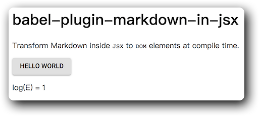

# babel-plugin-markdown-in-jsx

这是一个 babel 插件，帮助你在 jsx 中使用 Markdown。

``` js
import * as React from 'react';
import Markdown from 'babel-plugin-markdown-in-jsx/component';
import Button from '@material-ui/core/Button';

function TestComponent() {
  return (
    <Markdown>
      # babel-plugin-markdown-in-jsx

      Transform Markdown inside `JSX` to `DOM` elements at compile time.

      <Button variant="contained">Hello World</Button>

      log(E) = {Math.log(Math.E)}
    </Markdown>
  )
}
```



## Getting Started

在你的项目中打开终端，输入以下代码。
``` bash
npm install --save-dev babel-plugin-markdown-in-jsx
```

修改 .babelrc
``` json
{
  "presets": [
    "@babel/preset-env",
    "@babel/react"
  ],
  "plugins": [
    "markdown-in-jsx"
  ]
}
```

首先你需要在代码中声明 `Markdown` 组件
``` js
const Markdown = require('babel-plugin-markdown-in-jsx/component');
```
也可以使用 `esmodule` 语法
``` js
import Markdown from 'babel-plugin-markdown-in-jsx/component';
```

> 这里声明的变量名 `Markdown` 是随意的，但包名必须是 `babel-plugin-markdown-in-jsx/component` 一字不差。
>
> 请注意，这条声明在编译后会被删除。

现在你就可以在 JSX 中使用 `Markdown` 组件。
组件中的文本会被作为 Markdown 编译成 HTML。
表达式和 JSX 组件会被保留在原地。

``` js
function TestComponent() {
  const imgsrc = 'img.png';
  return (
    <Markdown>
      # Markdown Hello world

      也可以插入JS表达式: log(E) = {Math.log(Math.E)}

      图片的链接也可以写变量: 

      <div>
        这里的内容不会被编译。

        <Markdown>
          # 这里的内容会作为 Markdown 编译。
        </Markdown>

      </div>
    </Markdown>
  )
}
```

## Inline Mode

`babel-plugin-markdown-in-jsx` 有一种 inline 模式。

在 `Markdown` 组件上加上 inline 属性，可以使用 inline 模式编译。

``` js
<Markdown>
  123
</Markdown>
编译后
<div>
  <p>123</p>
</div>
=============================
<Markdown inline>
  123
</Markdown>
编译后
<span>
  123
</span>
```

## Built-in Component Proxy

`babel-plugin-markdown-in-jsx` 提供一种方法可以自定义 `Markdown` 编译结果中的 React 原生组件。

有几种使用场景：

1. 如果你希望用更复杂的 `<custom-img />` 来替换原生的 ``。
2. 如果你使用 `css in js`，为 Markdown 内容增加样式可能会有困难。
3. 如果你想要给所有 `a` 标签加上 `target="_blank"`

你需要修改 `.babelrc` 打开 proxy 功能。

``` json
{
  "plugins": [
    ["markdown-in-jsx", {"proxy": true}]
  ]
}
```

`proxy` 功能使用了 `react` 的 `context` 来实现，[关于 Context 的详细信息](https://reactjs.org/docs/context.html)。

引入 `babel-plugin-markdown-in-jsx/component/proxy`

``` js
import * as Proxy from 'babel-plugin-markdown-in-jsx/component/proxy';
```

再使用 `<Proxy.Provider />` 并设置 `value` 属性

比如要替换文中所有的 `` 和 `<h1 />`

``` js
<Proxy.Provider 
  value={{
    img: CustomImage,
    h1: CustomH1
  }}
>
  ...
</Proxy.Provider>
```

`<Proxy.Provider />` 下面的所有 `<Markdown />` 都会被设置影响。

下面是一个为所有的图片增加红色边框的例子。

``` js
import * as React from 'react';
import Markdown from 'babel-plugin-markdown-in-jsx/component';
import * as Proxy from 'babel-plugin-markdown-in-jsx/component/proxy';

function CustomImage(props) {
  return (
    
  );
}

function TestComponent() {
  return (
    <Proxy.Provider value={{img: CustomImage}}>
      <Markdown>
        # babel-plugin-markdown-in-jsx

        Transform Markdown inside `JSX` to `DOM` elements at compile time.

        
      </Markdown>
    </Proxy.Provider>
  )
}
```


## License

[GNU General Public License Version 3](https://www.gnu.org/licenses/gpl-3.0.html)